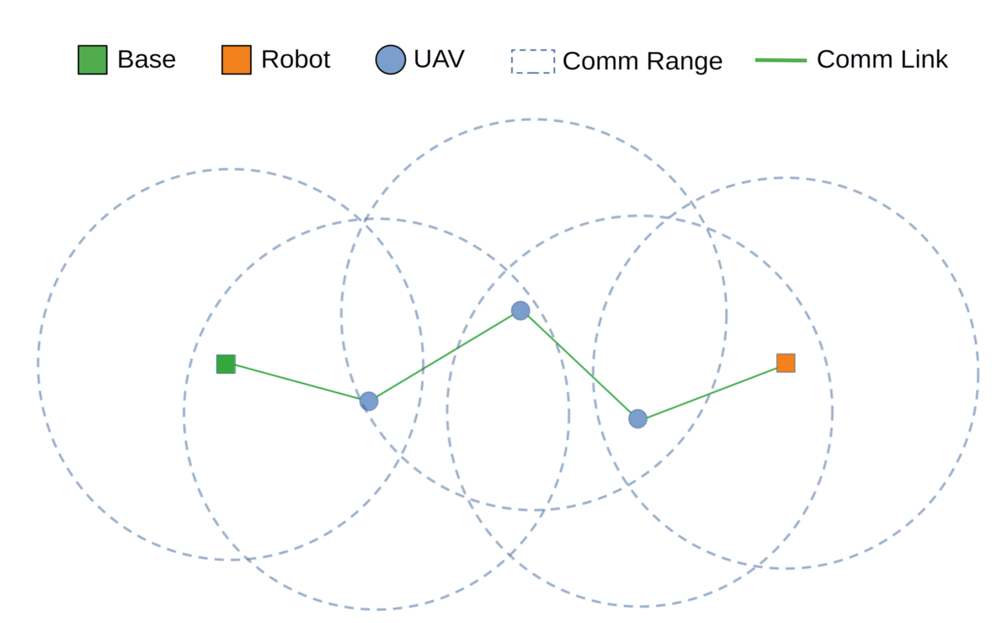
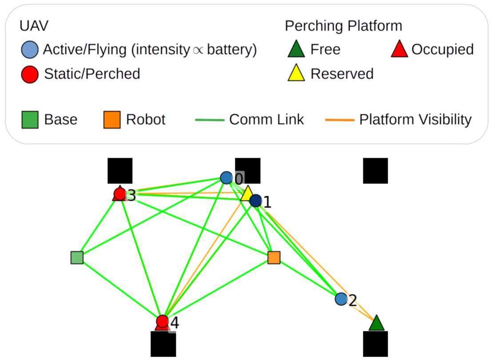

# mrs_connectivity_perch - Multi-Robot Simulation


This repository contains a Gymnasium-based simulation environment developed for our work “Perch-Aware Decentralized Control for Extending the Lifetime of UAV Communication Networks,” accepted for presentation at the IEEE International Symposium on Multi-Robot and Multi-Agent Systems (IEEE MRS 2025) in Singapore [<a href="#ref1">1</a>].

The associated video demonstration is available [here](https://youtu.be/u8JEi_p27BQ).


## Problem Overview

A ground robot is exploring the field autonomously to search for items. First responders are monitoring it from a base station. However, long-range communication is unavailable, so we must rely on short-range onboard communication.  

For this purpose, UAVs act as relays, forming an ad-hoc communication network between the ground robot and the base. An example of this is shown below:

<div align="center">
  
</div>

Additionally, UAVs have limited battery capacity, which depletes over time. To conserve energy, UAVs can perch at designated perching spots while still serving as communication relays. A UAV is removed from the network if it battery falls below 5%.

## Installation

### Prerequisites
- Docker and Docker Compose
- X11 forwarding enabled (for GUI visualization)

### Quick Start
1. **Clone and build:**
   ```bash
   git clone <repository-url>
   cd mrs_connectivity_perch
   docker compose build
   ```

2. **Run simulation:**
   ```bash
   docker compose run --rm mrs_connectivity_perch python mrs_connectivity_perch/tests/test_perch.py config_mapv1_case2.yaml
   ```

3. **Interactive mode:**
   ```bash
   docker compose run --rm mrs_connectivity_perch bash
   # Inside container:
   python mrs_connectivity_perch/tests/test_perch.py <config_file>
   ```

Look at the available config.yaml files in the `mrs_connectivity_perch/tests/` directory to understand how to set up mission configurations of your own.

Use the figure below as a reference to understand the symbols used:

<div align="center">
  
</div>

---


## References

<a id="ref1"></a>
[1]: K.G. Alamdar, M. Peti, F. Petric and M. Orsag. "Decentralized Battery-Aware Connectivity Maintenance for Multi-UAV Missions," in 2025 International Symposium on Multi-Robot and Multi-Agent Systems (MRS), 2025, doi: NA. (Accepted)